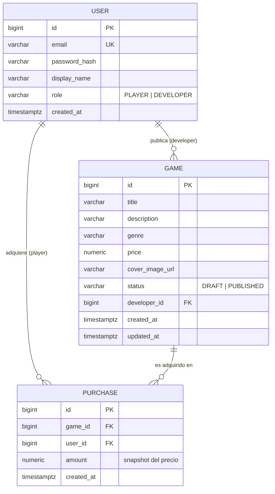
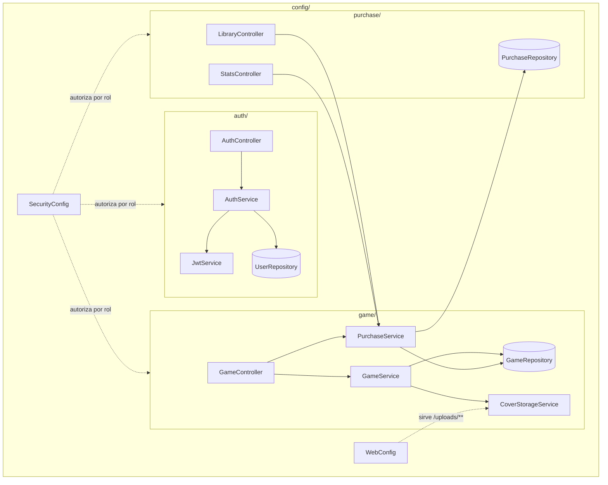
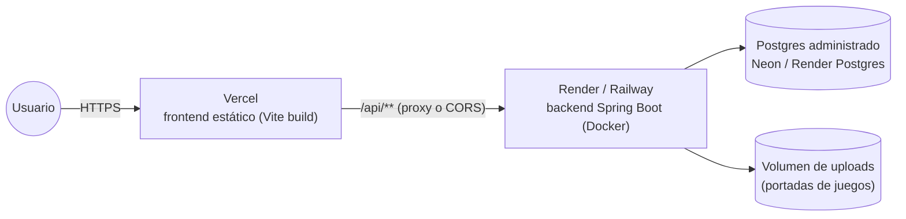

# Diagramas

Mermaid en vez de imágenes exportadas: se versiona como texto (diff legible
en cada PR) y GitHub lo renderiza nativamente en el README/docs sin build
adicional.

## Modelo de datos (ER)

`PURCHASE` tiene una restricción única `(user_id, game_id)`: un jugador no
puede comprar el mismo juego dos veces (ver `docs/08-purchases-stats.md`).
Ningún `USER` tiene ambos roles a la vez — `role` es un solo enum, no una
tabla de permisos, porque el dominio no lo necesita (spec: dos roles fijos,
sin roles compuestos).

## Backend: paquetes y responsabilidades

Cada paquete es dueño de su propio repositorio JPA; `purchase/` es el único
que depende de `game/` (necesita `GameRepository` para el precio y para las
stats), nunca al revés — evita un ciclo de dependencias entre paquetes.

## Despliegue

Detalle de cómo configurar cada pieza en `docs/10-deploy-guide.md`.
